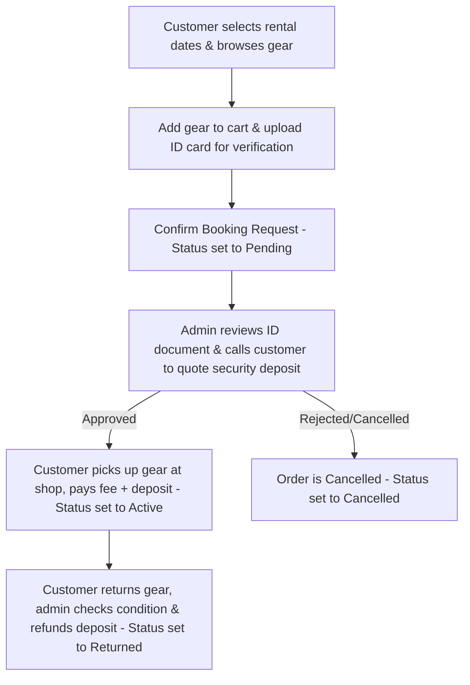

# Product Requirements Document (PRD): Daily Lens & Gear

**Project:** Daily Lens & Gear (Camera & Lens Rental Web Application)  
**Status:** Draft  
**Version:** 1.0  
**Date:** July 13, 2026  
**Author:** AI Assistant (Antigravity)  

---

## 1. Introduction & Objectives

### 1.1 Background & Problem Statement
Currently, professional photographers, hobbyists, and content creators frequently need high-end camera bodies and lenses for short-term projects. Purchasing this equipment represents a significant capital expenditure, making rental the ideal alternative. However, many existing camera rental shops lack streamlined online booking systems, real-time availability checking, and effective admin tools for managing order verification and inventory.

### 1.2 Objectives
*   Develop a user-friendly, responsive, and visually premium camera/lens rental web application (inspired by the Leaseycam design aesthetic).
*   Enable customers to check real-time gear availability for specified rental dates and make online booking reservations (Reserve Online, Pay at Pickup).
*   Provide shop admins with a robust Admin Dashboard to verify customer credentials, approve bookings, manage inventory, and log equipment returns or maintenance status.

### 1.3 Target Audience
1.  **Customers (Photographers, Hobbyists, & Creators):** Users looking to temporarily rent high-end gear for personal or commercial projects.
2.  **Shop Admins:** Store staff responsible for tracking inventory, verifying renter IDs, approving bookings, quoting deposits, and managing returns.

---

## 2. Fulfillment & Payment Workflow (Lens Lineup Style)

The platform operates on a **Reserve Online, Pay at Pickup** model to ensure transaction security and equipment safety:

1.  **Reserve Online:** The customer logs in, selects start/end rental dates, views available gear, adds items to their cart, uploads a photo of their ID card, and submits the booking request. No online payment is processed at this stage.
2.  **Manual Verification:** The shop admin reviews the booking request and the uploaded ID card. The admin then contacts the customer via phone to confirm details and quote the security deposit.
3.  **Fulfillment & Pickup:** On the rental start date, the customer visits the shop, presents their physical ID card, pays the rental fee and the security deposit, and collects the equipment. The order status shifts to `active`.
4.  **Return & Deposit Refund:** Upon rental completion, the customer returns the gear. The admin inspects the equipment's condition and manually processes the deposit refund. The status updates to `returned`.

---

## 3. Product Features & Functional Requirements

The application consists of 6 core screens:

### 3.1 Customer-Facing Features

#### A. Homepage & Catalog (`index.html`)
*   **Hero Date Selector:** Prominent inputs forcing users to specify their rental **Start Date** and **End Date** before browsing.
*   **Dynamic Catalog Grid:** Displays rental gear. The grid must automatically filter out gear that is already booked (i.e., has overlapping dates with existing `pending` or `active` orders) or is currently marked under maintenance.
*   **Brand Filters:** Logo badges (Canon, Sony, Nikon, Fujifilm, Leica, Panasonic) that filter the catalog grid when clicked.
*   **Shopping Cart Drawer:** A slide-out panel that displays cart items, counts total rental days, calculates subtotal costs, and includes a checkout CTA.

#### B. Checkout Review (`checkout.html`)
*   **Verify Items:** List of selected equipment, rates, and rental subtotals.
*   **Rental Details:** Summarized rental duration, pickup/return dates, and total amount payable at pickup.
*   **ID Card Upload Area:** A drag-and-drop or file-selector upload box with a dashed border for submitting a photo of the user's ID card.
*   **Book Equipment CTA:** Button to submit the booking request (creates a `pending` order).

#### C. My Bookings Portal (`bookings.html`)
*   **Tabs Navigation:** Separates "Active & Pending Rentals" from "Rental History (Returned & Cancelled)".
*   **Order Cards:** Product image, model name, date range, daily rate, total amount, and color-coded status badges (`● Pending` in orange, `● Active` in green, `● Returned` in gray, `● Cancelled` in red).

#### D. Login & Registration (`login.html`)
*   **Authentication Card:** Simple, clean registration and login forms supporting both `customer` and `admin` roles.
*   **Token Management:** Stores JWT on the client side for authorization.

#### E. Steps & Conditions (`terms.html`)
*   **How it Works:** Informational section detailing rental policies, pickup hours, and late-return fee terms.

---

### 3.2 Admin-Facing Features

#### F. Admin Dashboard (`admin.html`)
*   **Overview Metrics Widgets:** Key metrics displays:
    *   *Pending Verification:* Count of orders awaiting approval.
    *   *Active Rentals:* Number of equipment units currently checked out.
    *   *Monthly Earnings:* Total revenue logged for the month.
*   **Booking Management Table:**
    *   Table listing all orders, filterable by status.
    *   Preview of the customer's uploaded ID card.
    *   Action buttons for status transitions:
        *   `Approve & Release Gear` (Pending -> Active): Set when the user picks up the gear and pays.
        *   `Confirm Return` (Active -> Returned): Logged upon checking returned equipment.
        *   `Cancel Booking` (Pending -> Cancelled): For invalid requests, cancellations, or failure to contact the renter.
*   **Inventory Stock Controller:**
    *   View all gear in inventory.
    *   Toggle switches to change equipment availability status between `available` and `maintenance`.
    *   Input fields to update the daily rental rate (`pricePerDay`) for any equipment item.

---

## 4. Architecture & Technical Specifications

### 4.1 Tech Stack
*   **Frontend:** Pure HTML5, Vanilla CSS3 (no Tailwind unless requested), Vanilla JavaScript (ES6+).
*   **Backend:** Node.js with Express for server routing, serving static files, and REST API endpoints.
*   **Database:** MongoDB with Mongoose ODM.
*   **Authentication:** JWT-based stateless authentication.

### 4.2 Data Schemas

#### User Schema
*   `_id` (ObjectId)
*   `name` (String, Required)
*   `email` (String, Required, Unique)
*   `password` (String, Hashed, Required)
*   `role` (String, Enum: `['customer', 'admin']`, Default: `'customer'`)
*   `cart` (`[{ equipmentId, quantity }]`)

#### Equipment Schema
*   `_id` (ObjectId)
*   `name` (String, Required)
*   `brand` (String, Required)
*   `category` (String, Enum: `['Body', 'Lens', 'Flash', 'Adapter']`, Required)
*   `pricePerDay` (Number, Required)
*   `deposit` (Number, Required)
*   `status` (String, Enum: `['available', 'maintenance']`, Default: `'available'`)

#### Order Schema
*   `_id` (ObjectId)
*   `renterId` (ObjectId, Ref: `User`, Required)
*   `equipmentId` (ObjectId, Ref: `Equipment`, Required)
*   `startDate` (Date, Required)
*   `endDate` (Date, Required)
*   `rentalFee` (Number, Required)
*   `deposit` (Number, Required)
*   `totalAmount` (Number, Required)
*   `status` (String, Enum: `['pending', 'active', 'returned', 'cancelled']`, Default: `'pending'`)
*   `verificationDoc` (`{ idCardImageUrl: String, uploadedAt: Date }`)
*   `cancelReason` (String)

---

## 5. UI/UX & Design Guidelines (Leaseycam-Inspired)

*   **Color Palette:**
    *   *Primary Background:* Pure White (`#FFFFFF`) with light gray canvas (`#F8F9FA`).
    *   *Primary Accent:* Warm Amber Gold (`#F5A623` / `#FFB200`) for primary buttons and active states.
    *   *Text:* Deep Charcoal Black (`#1A1A1A`).
    *   *Status Badges:* Mint Green (`#2EC4B6`) for active; Coral Red (`#E63946`) for cancelled.
*   **Visual Geometry:**
    *   Highly rounded corners (`16px` to `24px` border-radius) for inputs, cards, and buttons.
    *   Extremely soft, light shadows (`box-shadow: 0 8px 30px rgba(0,0,0,0.04)`).
*   **Micro-interactions:**
    *   Smooth transitions and subtle scale effects (`transform: scale(1.02)`) on button and card hover states.
    *   Slide-in cart drawer transitions.

---

## 6. Non-Functional Requirements

*   **Security:** Cryptographic password hashing (e.g., bcrypt) and JWT authorization for admin endpoints.
*   **Performance:** Fast index page rendering and SEO structure using HTML5 semantic elements.
*   **Responsiveness:** Fluid media query layout adjustments for mobile, tablet, and desktop viewports.

---

## 7. Verification & Testing Plan

### 7.1 Backend API Tests
*   **Auth Routes:** Testing customer/admin login/register operations.
*   **Availability Filtering:** Verification that date overlapping queries correctly exclude rented gear.

### 7.2 Frontend & E2E Verification
*   Simulated date changes to verify correct disabling of catalog cards.
*   ID upload test and verification that order request populates the admin queue.
