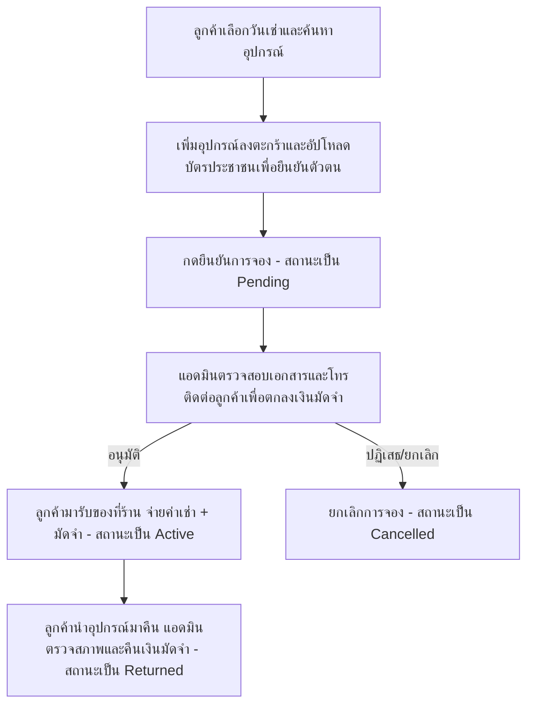

# Product Requirements Document (PRD): Daily Lens & Gear (ภาษาไทย)

**โครงการ:** Daily Lens & Gear (Camera & Lens Rental Web Application)  
**สถานะ:** ร่าง (Draft)  
**เวอร์ชัน:** 1.0  
**วันที่เขียน:** 13 กรกฎาคม 2026  
**ผู้เขียน:** AI Assistant (Antigravity)  

---

## 1. บทนำและวัตถุประสงค์ (Introduction & Objectives)

### 1.1 ความเป็นมาและปัญหา (Background & Problem Statement)
ในปัจจุบัน ช่างภาพ, คอนเทนต์ครีเอเตอร์ และผู้ที่สนใจถ่ายภาพทั่วไป มักมีความต้องการใช้กล้องและเลนส์ระดับ High-end สำหรับงานเฉพาะกิจชั่วคราว แต่การซื้ออุปกรณ์เหล่านี้มีราคาสูงมาก การเช่าจึงเป็นทางเลือกที่ดีที่สุด อย่างไรก็ตาม บริการเช่ากล้องส่วนใหญ่ยังขาดความสะดวกในการจองออนไลน์ การตรวจสอบสถานะความพร้อมของอุปกรณ์แบบเรียลไทม์ และระบบบริหารจัดการหลังบ้านที่มีประสิทธิภาพสำหรับร้านค้า

### 1.2 วัตถุประสงค์ (Objectives)
*   เพื่อสร้างเว็บแอปพลิเคชันสำหรับบริการเช่ากล้องและเลนส์ที่ใช้งานง่าย รวดเร็ว และมีการออกแบบที่สวยงาม พรีเมียม (Leaseycam-inspired Design)
*   เพื่อเพิ่มความสะดวกให้ลูกค้าสามารถตรวจสอบความพร้อมของอุปกรณ์ตามวันที่กำหนด และทำการจองออนไลน์ได้ทันที (Reserve Online, Pay at Pickup)
*   เพื่อสนับสนุนระบบการตรวจสอบข้อมูลลูกค้าและการจัดการคลังสินค้าของร้านค้าผ่านหน้าต่างแอดมิน (Admin Dashboard)

### 1.3 กลุ่มเป้าหมาย (Target Audience)
1.  **ช่างภาพมืออาชีพและสมัครเล่น (Photographers/Hobbyists):** ต้องการใช้กล้องหรือเลนส์รุ่นเฉพาะสำหรับงานพิเศษ
2.  **คอนเทนต์ครีเอเตอร์ (Content Creators):** ต้องการอุปกรณ์คุณภาพสูงในระยะเวลาสั้นๆ
3.  **ผู้ดูแลระบบของร้าน (Shop Admins):** เจ้าหน้าที่ร้านเช่าที่ทำหน้าที่ดูแลคลังสินค้า ตรวจสอบเอกสารอนุมัติ และบันทึกการส่งคืน/ยกเลิกรายการเช่า

---

## 2. ขั้นตอนการดำเนินงานและการจอง (Fulfillment & Payment Workflow)

แพลตฟอร์มนี้จะใช้รูปแบบ **Reserve Online (Pay at Pickup)** โดยมีขั้นตอนดังต่อไปนี้:

1.  **การจองออนไลน์ (Reserve Online):** ลูกค้าเข้าสู่ระบบ เลือกช่วงวันที่ต้องการเช่า เลือกอุปกรณ์ที่ว่างในช่วงเวลาดังกล่าว อัปโหลดรูปบัตรประชาชนเพื่อยืนยันตัวตน และกดสั่งจองโดยยังไม่ต้องชำระเงินออนไลน์
2.  **การยืนยันข้อมูลจากทางร้าน (Manual Verification):** เจ้าหน้าที่ร้านเช่า (Admin) จะได้รับข้อมูลคำสั่งจอง จากนั้นจะตรวจสอบรูปบัตรประชาชนและติดต่อลูกค้าทางโทรศัพท์เพื่อแจ้งยืนยันและเสนอค่ามัดจำอุปกรณ์ (Security Deposit)
3.  **การส่งมอบและชำระเงิน (Fulfillment):** ในวันรับของ ลูกค้าจะต้องนำบัตรประชาชนตัวจริงมาแสดง ชำระค่าเช่าร่วมกับเงินมัดจำตามที่ระบุ และรับอุปกรณ์ไปใช้งาน (สถานะจะเปลี่ยนเป็น Active)
4.  **การคืนอุปกรณ์และคืนเงินมัดจำ (Return & Refund):** เมื่อครบกำหนด ลูกค้านำอุปกรณ์มาคืน แอดมินตรวจสภาพความเรียบร้อยของสินค้า และทำการคืนเงินมัดจำให้ลูกค้าด้วยตนเอง (สถานะเปลี่ยนเป็น Returned)

---

## 3. ความต้องการของระบบ (Product Features & Functional Requirements)

ระบบประกอบด้วย 6 หน้าจอหลัก พร้อมคุณสมบัติดังนี้:

### 3.1 ระบบสำหรับลูกค้า (Customer-Facing Features)

#### A. หน้าหลักและแคตตาล็อกสินค้า (Homepage & Catalog - `index.html`)
*   **Hero Date Selector:** บังคับให้ผู้ใช้เลือก **วันที่เริ่มต้น (Start Date)** และ **วันที่สิ้นสุด (End Date)** ก่อนทำรายการเช่า
*   **Dynamic Catalog Grid:** แสดงรายการอุปกรณ์กล้องและเลนส์ โดยระบบจะต้องกรองเอาอุปกรณ์ที่ถูกจองแล้วในช่วงเวลาที่เลือกออกไปโดยอัตโนมัติ (อิงจากประวัติการจองในฐานข้อมูลที่มีสถานะ `pending` หรือ `active` คาบเกี่ยวกัน)
*   **Brand Filters:** แถบเลือกแบรนด์อุปกรณ์ยอดนิยม (เช่น Canon, Sony, Nikon, Fujifilm, Leica, Panasonic) เพื่อกรองรายการสินค้าอย่างรวดเร็ว
*   **Shopping Cart Drawer:** แถบด้านข้าง (Slide-out Drawer) แสดงรายการที่เตรียมจอง พร้อมคำนวณจำนวนวันเช่า ค่าเช่าต่อวัน และราคารวมเบื้องต้น พร้อมทั้งมีปุ่ม Verify Booking นำไปสู่การส่งเอกสาร

#### B. หน้าตรวจสอบและทำรายการจอง (Checkout Review - `checkout.html`)
*   **Verify Items:** คอลัมน์แสดงรายละเอียดอุปกรณ์ที่เลือก ระยะเวลา และราคารายวัน
*   **Rental Details:** แสดงสรุปวันรับและวันคืนเงิน, หมายเหตุการมัดจำ ("ร้านค้าจะติดต่อเพื่อแจ้งยอดมัดจำอีกครั้ง"), และยอดรวมค่าเช่าที่ต้องชำระในวันรับของ
*   **ID Card Upload Area:** กล่องอัปโหลดรูปภาพบัตรประชาชน (Dashed-border upload box) เพื่อประกอบการพิจารณาของแอดมิน
*   **Book Equipment CTA:** ปุ่มกดเพื่อยืนยันการส่งคำขอเช่า

#### C. หน้าประวัติการเช่า (My Bookings Portal - `bookings.html`)
*   **Tabs Navigation:** สลับดูระหว่าง "รายการเช่าที่กำลังดำเนินการ (Active/Pending)" และ "ประวัติการเช่าในอดีต (Returned/Cancelled)"
*   **Order Cards:** แสดงภาพตัวอย่าง, ชื่อรุ่น, ช่วงวันที่เช่า, ยอดรวม และแถบแสดงสถานะสีต่างๆ (เช่น สีส้มสำหรับ `● Pending`, สีเขียวสำหรับ `● Active`, สีเทาสำหรับ `● Returned`, สีแดงสำหรับ `● Cancelled`)

#### D. หน้าระบบสมาชิกและการลงทะเบียน (Login & Register - `login.html`)
*   **Authentication Form:** ฟอร์มสลับฝั่งระหว่างการเข้าสู่ระบบและสมัครสมาชิก รองรับทั้งประเภทผู้ใช้งานทั่วไป (`customer`) และผู้ดูแลระบบ (`admin`)
*   **Authentication Storage:** จัดเก็บ Token (JWT) บน Client-side เพื่อตรวจสอบสิทธิ์การใช้งาน

#### E. หน้าข้อมูลเงื่อนไขและขั้นตอน (Steps & Conditions - `terms.html`)
*   **How it Works:** คำอธิบายขั้นตอนการจอง 4 ขั้นตอน นโยบายร้านค้า เวลาเปิด-ปิดร้าน และเงื่อนไขการปรับเมื่อคืนสินค้าล่าช้า

---

### 3.2 ระบบสำหรับผู้ดูแลระบบ (Admin-Facing Features)

#### F. หน้าแดชบอร์ดแอดมิน (Admin Dashboard - `admin.html`)
*   **Overview Metrics Widgets:** การแสดงผลตัวชี้วัดสำคัญของร้านค้า ได้แก่
    *   จำนวนรายการจองที่รอการตรวจสอบ (Pending Verification)
    *   จำนวนกล้องที่กำลังถูกเช่าอยู่ ณ ปัจจุบัน (Active Rentals)
    *   ยอดรายได้จากการเช่าประจำเดือน (Monthly Earnings)
*   **Booking Management Table:** ตารางจัดการคำสั่งเช่าทั้งหมด
    *   การกรองสถานะรายการ (Pending, Active, Returned, Cancelled)
    *   การตรวจสอบภาพบัตรประชาชนที่ลูกค้าอัปโหลดเข้ามา
    *   ปุ่ม Action เพื่อเปลี่ยนสถานะคำสั่งจอง:
        *   `Approve & Release Gear` (เมื่อตรวจสอบและส่งมอบกล้องให้ลูกค้าเรียบร้อยแล้ว เปลี่ยนสถานะจาก Pending -> Active)
        *   `Confirm Return` (เมื่อรับของคืน ตรวจสภาพเสร็จสิ้น เปลี่ยนสถานะจาก Active -> Returned)
        *   `Cancel Booking` (กรณีติดต่อลูกค้าไม่ได้ หรือไม่ผ่านการตรวจสอบเอกสาร เปลี่ยนสถานะเป็น Cancelled)
*   **Inventory Stock Controller:** ส่วนควบคุมและตรวจสอบคลังสินค้า
    *   แสดงรายการอุปกรณ์ทั้งหมดของร้าน
    *   สามารถเปิด-ปิดสวิตช์สถานะอุปกรณ์ระหว่าง "พร้อมให้บริการ (Available)" และ "อยู่ระหว่างซ่อมบำรุง (Maintenance)"
    *   ช่องสำหรับปรับแต่งราคาเช่าต่อวัน (Price Per Day) ของแต่ละอุปกรณ์ได้โดยตรง

---

## 4. ความต้องการเชิงสถาปัตยกรรมและเทคโนโลยี (Architecture & Tech Stack)

### 4.1 Tech Stack ที่เลือกใช้
*   **Frontend:** Pure HTML5, Vanilla CSS3 (เน้นโครงสร้างสไตล์ที่พรีเมียม), และ Vanilla JavaScript (ES6+) สำหรับการจัดการ DOM และการทำ AJAX API Requests
*   **Backend:** Node.js พร้อม Express Framework ในการรัน API Server และทำหน้าที่เสิร์ฟไฟล์ Static Web
*   **Database:** MongoDB ร่วมกับ Mongoose ODM ในการวางโครงสร้างและจัดการฐานข้อมูล
*   **Authentication:** JSON Web Tokens (JWT) สำหรับจัดเก็บสิทธิ์ผู้ใช้ในระบบ

### 4.2 โครงสร้างข้อมูล (Data Schemas)

#### User (ผู้ใช้งาน)
*   `_id` (ObjectId)
*   `name` (String, Required)
*   `email` (String, Required, Unique)
*   `password` (String, Hashed, Required)
*   `role` (String, Enum: `['customer', 'admin']`, Default: `'customer'`)
*   `cart` (Array of objects: `[{ equipmentId, quantity }]`)

#### Equipment (อุปกรณ์กล้องและเลนส์)
*   `_id` (ObjectId)
*   `name` (String, Required)
*   `brand` (String, Required)
*   `category` (String, Enum: `['Body', 'Lens', 'Flash', 'Adapter']`, Required)
*   `pricePerDay` (Number, Required)
*   `deposit` (Number, Required)
*   `status` (String, Enum: `['available', 'maintenance']`, Default: `'available'`)

#### Order (คำสั่งจองและประวัติเช่า)
*   `_id` (ObjectId)
*   `renterId` (ObjectId, Ref: `User`, Required)
*   `equipmentId` (ObjectId, Ref: `Equipment`, Required)
*   `startDate` (Date, Required)
*   `endDate` (Date, Required)
*   `rentalFee` (Number, Required)
*   `deposit` (Number, Required)
*   `totalAmount` (Number, Required)
*   `status` (String, Enum: `['pending', 'active', 'returned', 'cancelled']`, Default: `'pending'`)
*   `verificationDoc` (Object: `{ idCardImageUrl: String, uploadedAt: Date }`)
*   `cancelReason` (String)

---

## 5. การออกแบบและมิติภาพลักษณ์ (UI/UX & Design Guidelines)

เพื่อส่งมอบประสบการณ์ระดับพรีเมียมตามสไตล์ของ **Leaseycam** นักพัฒนาต้องปฏิบัติตามแนวทางการออกแบบดังนี้:

*   **โทนสี (Color Palette):**
    *   สีพื้นหลังหลัก: Pure White (`#FFFFFF`) คู่กับสีเทาอ่อน (`#F8F9FA`) เพื่อเพิ่มมิติความกว้างและสะอาดตา
    *   สีเน้นการดำเนินงาน (Primary Accent): สีทองอุ่น / สีส้มแอมเบอร์ (`#F5A623` หรือ `#FFB200`) สำหรับปุ่มหลัก, สัญญาณเตือน, และส่วนที่ต้องการความสนใจ
    *   สีข้อความ: Deep Charcoal Black (`#1A1A1A`) เพื่อความคมชัดและความเป็นโมเดิร์น
    *   สีของป้ายสถานะ: สีเขียวมินต์/เทอร์ควอยส์ (`#2EC4B6`) สำหรับของที่ใช้งานอยู่/จัดส่งสำเร็จ และ สีแดงปะการัง (`#E63946`) สำหรับสถานะการยกเลิก
*   **องค์ประกอบรูปทรง (Geometry):**
    *   ใช้ความโค้งมนขนาดใหญ่ (`16px` ถึง `24px` สำหรับกรอบการ์ดสินค้า, ช่องป้อนข้อมูล และปุ่มกดต่าง ๆ)
    *   การใช้เงาแบบฟุ้งละเอียดเป็นพิเศษ (`box-shadow: 0 8px 30px rgba(0,0,0,0.04)`) หลีกเลี่ยงเงาหนาทึบและมีสีเข้ม
*   **อนิเมชันและเอฟเฟกต์ (Micro-animations):**
    *   ใช้ Hover transitions บนปุ่มและแคตตาล็อกการ์ด (เช่น การขยายขนาดเล็กน้อย `scale(1.02)` หรือการปรับความสว่างของแสงเงา)
    *   การทำ Slide-in จากฝั่งขวาสำหรับหน้าจอตะกร้าสินค้า (Cart Drawer)

---

## 6. ข้อกำหนดที่ไม่ได้เป็นฟังก์ชันโดยตรง (Non-Functional Requirements)

*   **Security (ความปลอดภัย):** รหัสผ่านของผู้ใช้งานจะต้องถูกแฮชก่อนการจัดเก็บ (ด้วย bcrypt หรืออัลกอริทึมที่ปลอดภัยเทียบเท่า) และการใช้งานระบบหลังบ้านแอดมินจะต้องมีการเช็ค JWT Token เสมอ
*   **Performance & SEO:** การโหลดหน้าแรกของแคตตาล็อกจะต้องรวดเร็วเพื่อไม่ให้เกิดความล่าช้าแก่ผู้ใช้ และรองรับการทำ SEO เบื้องต้นด้วยโครงสร้าง HTML5 Semantic Tags
*   **Responsiveness:** แสดงผลได้อย่างเหมาะสมบน Desktop และ Mobile (ผ่านการใช้ Flexbox/Grid และ Media Queries ที่ดี)

---

## 7. แผนการตรวจสอบและรับรองคุณภาพ (Verification & Testing Plan)

### 7.1 การทดสอบระบบหลังบ้าน (Backend API Tests)
*   **Auth Routes:** ตรวจสอบการสมัครสมาชิก, การล็อกอิน และการสกัดบทบาทของสิทธิ์ (`customer` เทียบกับ `admin`)
*   **Equipment Overlap Logic:** เขียนทดสอบการคำนวณและดึงรายการสินค้า ให้มั่นใจว่าแอปพลิเคชันไม่แสดงอุปกรณ์ที่ติดสถานะเช่าในช่วงเวลาเดียวกัน

### 7.2 การทดสอบฝั่งหน้าบ้าน (Frontend & Integration Tests)
*   การสลับวันเช่าในแคตตาล็อก เพื่อเช็คว่าปุ่มจองแสดงคำว่า "Unavailable" บนสินค้าที่ติดคิวจองจริงหรือไม่
*   การจำลองอัปโหลดรูปภาพและการจอง เพื่อยืนยันว่าคำขอจองไปปรากฏอยู่บนหน้าของ Admin Dashboard และอัปเดตสถานะสำเร็จ
